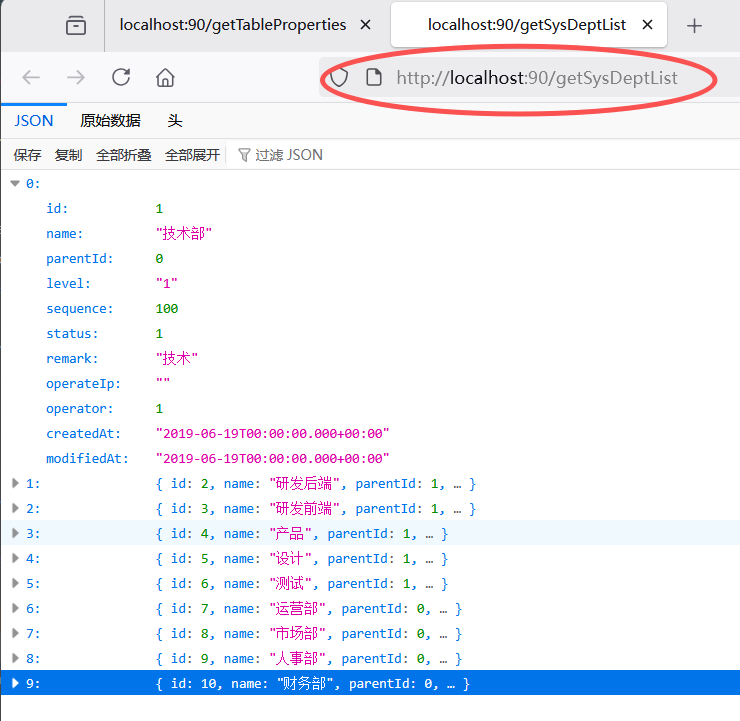
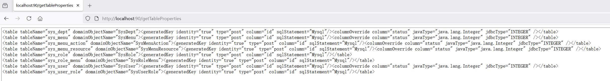

本项目除了 MBG 扩展功能之外，还会顺带讨论有关 MySQL 配置项 `lower_case_table_names` 的三个值，以及在开发和生产环境如果配置不同，如何有效避免大小写敏感与否的问题。

# 说明
- 本项目最初想要解决数据库表名、字段名以下划线命名法，生成的实体类（Model）与 java 的类、属性驼峰命名法不一致带来的一系列问题
> 后来发现通过 MyBatis 配置就能解决，下面有说明
- 除此之外，[分库分表插件](https://gitee.com/uncleAndyChen/mybatis-plugin-shard)，需要用该项目生成XML映射文件。更详细的，请查看: [MBG 扩展类 module](https://gitee.com/uncleAndyChen/mybatis-generator-enhance/tree/master/mybatis-generator-enhance)
- 已添加查询示例，不过仅仅是查询示例，没有考虑到项目架构的合理性。实际项目不会在 web 层直接调用 dal 层，实际项目会有业务层和接口层

# 运行
- 安装 MySQL，执行 `boot-create-table-property/resources/schema.sql` 脚本
- 修改 `boot-create-table-property/resources/application.yml` 中的数据库连接参数
- 运行启动项目：`boot-create-table-property`
- 访问：http://localhost:90/getSysDeptList
- 如果看到初始化的部门信息，则表示运行成功


# 自行测试
- 添加、修改表结构
- 参照 `mybatis-generator-enhance\src\main\resourcesgeneratorConfig.xml`，重新生成 mapper
- 参照 `demo.domain.dal.service.SysDeptDalService.getSysDeptList()` 实现数据库查询方法
- 参照 `table.property.controller.QueryDatabaseTestController.getSysDeptList()` 运行查询测试

# MyBatis Generator (MBG)，写扩展类，适应分表时动态替换表名
## 生成表配置信息
两种方式
1. `boot-create-table-property` 工程采用 spring boot v3.5.6 创建，可直接运行，运行之后，访问：`http://localhost:90/getTableProperties`
    
1. 运行测试`WithApplicationContextTest.getTablePropertiesTest`，从控制台查看。

## 项目地址
- gitee: https://gitee.com/uncleAndyChen/mybatis-generator-enhance
- github: https://github.com/uncleAndyChen/mybatis-generator-enhance

如果觉得不错，欢迎star以表支持。

## 子项目
- MBG扩展类：https://gitee.com/uncleAndyChen/mybatis-generator-enhance/tree/master/mybatis-generator-enhance
- 生成 MBG 需要的表配置内容：https://gitee.com/uncleAndyChen/mybatis-generator-enhance/tree/master/boot-create-table-property

## 建议在实际工作中的运行方式 
### cmd 窗口运行 jar 文件
- 下载 MBG 的jar包，[传送门](https://github.com/mybatis/generator/releases)，解压，找到`mybatis-generator-1.3.7.jar`备用。
- 执行项目根目录下的 `package.bat`，生成的 jar 文件：`mybatis-generator-enhance\target\mybatis-generator-enhance-0.0.1.jar`，会用到
- 将两个jar文件以及配置文件放到model与dal项目所在的目录下，在 cmd 窗口执行：
```shell
java -Dfile.encoding=UTF-8 -cp mybatis-generator-core-1.4.2.jar;mybatis-generator-enhance\target\mybatis-generator-enhance-0.0.1.jar;mysql-connector-j-8.0.33.jar org.mybatis.generator.api.ShellRunner -configfile mybatis-generator-enhance\src\main\resources\generatorConfig.xml -overwrite -verbose

# 其中，-verbose 是打印执行过程
```
> 这里通过 -cp 指定需要用到的所有jar包，用分号隔开，这样在运行的时候才能找到相应的类。

把相关依赖打到一起，用一个 jar 文件执行，更方便
在项目 mybatis.generator.enhance 的 pom.xml 添加打包插件，如下：
```xml
<plugin>
   <!-- https://mvnrepository.com/artifact/org.apache.maven.plugins/maven-assembly-plugin -->
   <groupId>org.apache.maven.plugins</groupId>
   <artifactId>maven-assembly-plugin</artifactId>
   <version>3.7.1</version>
   <configuration>
      <!-- 通过此标签可覆盖默认命名规则，直接指定输出文件名 -->
      <finalName>mybatis-generator-enhance-with-dependencies</finalName>
      <!-- 设置为 false 可消除文件名中的分类器部分（如-jar-with-dependencies） -->
      <appendAssemblyId>false</appendAssemblyId>
      <!-- 此配置可指定打包文件的输出路径，下面的配置，会将 jar 输出到项目根目录 -->
      <outputDirectory>${project.build.directory}/../../</outputDirectory>
      <archive>
         <manifest>
            <mainClass>mybatis.generator.enhance.IntrospectedTableEnhanceImpl</mainClass>
         </manifest>
      </archive>
      <descriptorRefs>
         <descriptorRef>jar-with-dependencies</descriptorRef>
      </descriptorRefs>
   </configuration>
   <executions>
      <execution>
         <phase>package</phase>
         <goals>
            <goal>single</goal>
         </goals>
      </execution>
   </executions>
</plugin>
```
通过包含相关依赖的 jar 包执行
```shell
java -Dfile.encoding=UTF-8 -cp mybatis-generator-enhance-with-dependencies.jar org.mybatis.generator.api.ShellRunner -configfile mybatis-generator-enhance\src\main\resources\generatorConfig.xml -overwrite -verbose

```

# 原理
简单的说，就是自己的实现类`IntrospectedTableEnhanceImpl`继承自MBG的一个具体实现类，重写获取表名的方法。

IntrospectedTable是MBG提供的一个比较基础的扩展类，相当于可以重新定义一个runtime。如果要通过继承IntrospectedTable完成扩展，需要自己来实现生成XML和Java代码的所有代码，也可以直接继承IntrospectedTableMyBatis3Impl，重写自己需要的业务逻辑，本模块就是直接继承自该类。

要扩展自己的业务逻辑，建议先仔细阅读IntrospectedTableMyBatis3Impl和IntrospectedTableMyBatis3SimpleImpl，这两个类用得多一些。

在MBG中，提供了几种默认的IntrospectedTable的实现，其实在context上设置的runtime对应的就是不同的IntrospectedTable的实现，下面是几种runtime和对应的实现类：
- MyBatis3 (default)：org.mybatis.generator.codegen.mybatis3.IntrospectedTableMyBatis3Impl
- MyBatis3Simple：org.mybatis.generator.codegen.mybatis3.IntrospectedTableMyBatis3SimpleImpl
- Ibatis2Java2：org.mybatis.generator.codegen.ibatis2.IntrospectedTableIbatis2Java2Impl
- Ibatis2Java5：org.mybatis.generator.codegen.ibatis2.IntrospectedTableIbatis2Java5Impl

# 通过本项目，可以学到的知识点
1. 可以理解使用MBG的大致流程。
1. 本文中用到的MBG配置可以作为一个标准配置的参考。
1. spring boot 2.1.5 获取 application.yml 配置信息，项目【boot-create-table-property】是一个很好的参考。
1. 通过MBG如何生成dal与model项目。
    - 生成的代码，绝大部分可直接使用，实现比如简单的：增、删、改、查。
    - 对应数据库表的实体类，一张表一个实体类，可用于在各层传递基于表数据的业务数据。
1. 通过 IDEA 管理多项目。
    - 获取项目源码，用 IDEA 导入的时候，指向根目录的 pom.xml 即可。

# 了解一下 lower_case_table_names 参数 
官方文档：[Identifier Case Sensitivity](https://dev.mysql.com/doc/refman/5.7/en/identifier-case-sensitivity.html)

1. lower_case_table_names是mysql一个大小写敏感设置的属性，此参数不可以动态修改，必须重启数据库。
1. unix,linux下lower_case_table_names默认值为 0 .Windows下默认值是 1 .Mac OS X下默认值是 2。

参数说明
- `lower_case_table_names=0` 表名存储为给定的大小写。比较时：区分大小写。大小写敏感（Unix，Linux默认）。
>　创建的库表将原样保存在磁盘上。如create database TeSt;将会创建一个TeSt的目录，create table AbCCC ...将会原样生成AbCCC.frm。SQL语句也会原样解析。

- `lower_case_table_names=1` 表名存储为小写。比较时：不区分大小写。大小写不敏感（Windows默认）。
> 创建的库表时，MySQL将所有的库表名转换成小写存储在磁盘上。SQL语句同样会将库表名转换成小写。如需要查询以前创建的Test_table（生成Test_table.frm文件），即便执行select * from Test_table，也会被转换成select * from test_table，致使报错表不存在。

- `lower_case_table_names=2` 表名存储为给定的大小写。比较时：小写。
> 创建的库表将原样保存在磁盘上。但SQL语句将库表名转换成小写。

## 不适用场景
如果开发环境、生产环境均配置成1或者2，则本文中有关大小写敏感的措施都是无意义的。

但是如果分库时依赖表名替换，则又是适用的，见以下【适用场景】中的场景二。

## 适用场景
最终目标：MBG 生成的xml文件中的sql脚本的表名，保持与对应表名在建表时的大小写一致，保持大小写敏感（表名可在MBG需要的配置文件中配置，以该配置为准）。这样可以适应以上`lower_case_table_names`的三种配置值。

**为了达到以上目标，[运行生成表配置内容的项目](https://github.com/uncleAndyChen/mybatis-generator-enhance/tree/master/boot-create-table-property)，一定要连接参数`lower_case_table_names`配置为0或者2的数据库服务器**，并且是配置为0或者2之后才创建的数据表，否则，生成的表配置内容的表名，是以全部小写为基准的，并非驼峰式命名法。表配置内容生成好之后，重新生成 mapper 时连接的数据库服务器的`lower_case_table_names`配置值，对生成结果没有影响。

### 适用场景一
1. 其中有数据库服务器被设置成大小写不敏感（比如阿里云的云数据库，截至目前2018年12月9号，还不支持配置成大小写敏感），即 `lower_case_table_names=1`，且该参数不能修改。
1. 假设程序代码遵循驼峰命名法。如果因为历史原因，或者有一个老项目，恰巧数据库也用了驼峰式命名法，包括：数据库名、数据库表名、数据库字段名。这样的话，可以控制`lower_case_table_names`的linux服务器，就可以将该参数设置为0，即大小写敏感。
1. 用 MGB 生成的 Mapper 类名，以及 xml 文件中的表名，需要与创建表名时的原始大小写一致，以适应在`lower_case_table_names=0`（linux）或者`lower_case_table_names=2`（windows）的情况。

当然，读到这里，你可能会觉得奇怪，数据库的库名、表名、字段名，业界都是用下划线命名法，全是小写字母，没有大写字母，所以，该参数被配置成什么都不需要关心。

那么，你说对了，如果数据库命名采用的是下划线命名法，那就且看工作中是否存在【适用场景二】吧。

### 适用场景二
- 分表，利用 MyBatis 插件，根据业务规则，对表名进行动态替换。
- 例如，表`erp_trade`分成了120个表，那么在某一次业务操作中，需要将`erp_trade`替换成`erp_trade_xyz`，其中`xyz`为从`001`到`120`的其中一个数字，则需要将 MBG 生成的 XML 映射文件里 sql 脚本中的表名用 \`（左上角数字键 1 的左边、Tab 键的上边、Esc 键的下边的键）引起来。
- 把表名用 \` 引起来的目的，是可以避免错误地局部替换，比如需要替换 `sys_user` 时，可避免把 `sys_user_role` 中的 `sys_user` 也替换掉。
> [基于 MyBatis 插件分库分表项目](https://gitee.com/uncleAndyChen/mybatis-plugin-shard)

# 生成表配置信息的 Java 工具类
- MBG 基于一个 xml 配置文件，在这个配置文件里，有跟表相关的配置，如果需要对不同类型的字段做处理，比如 tinyint 类型的字段，MBG 生成规则是：当长度为 1 时默认映射为 Boolean 类型，否则映射为Byte类型，在实际开发过程中，可能 tinyint 保存的是 int 类型，不光是 0 和 1，则需要通过表配置信息修改这个行为。
- 如此一来，存在 tinyint 需要生成 int 属性的表，都需要对应一行配置信息，手写的话，容易遗漏，也容易出错。
- 我写了一个类来自动生成，这样，在增减表，或者别的项目里面，可以简单的运行这个类来生成，解放双手，提高效率。

更详细的，请看：https://gitee.com/uncleAndyChen/mybatis-generator-enhance/tree/master/boot-create-table-property

# MBG 需要的配置文件
在工作中实际用到的文件内容，大致如下：
```xml
<?xml version="1.0" encoding="UTF-8"?>
<!DOCTYPE generatorConfiguration
        PUBLIC "-//mybatis.org//DTD MyBatis Generator Configuration 1.0//EN"
        "http://mybatis.org/dtd/mybatis-generator-config_1_0.dtd">
<generatorConfiguration>
    <!--数据库驱动-->
    <classPathEntry location="mysql-connector-java-5.1.31.jar"/>
    <!--<context id="DB2Tables" targetRuntime="MyBatis3">-->
    <!--如果你希望不生成和Example查询有关的内容，那么可以按照如下进行配置:-->
    <!--<context id="DB2Tables" targetRuntime="MyBatis3Impl">-->
    <context id="Mysql" targetRuntime="MyBatis3" defaultModelType="flat">
    <!--<context id="Mysql" targetRuntime="MyBatis3Simple" defaultModelType="flat">-->
        <commentGenerator>
            <property name="suppressDate" value="true"/>
            <property name="suppressAllComments" value="true"/>
        </commentGenerator>
        <!--数据库链接地址账号密码-->
        <jdbcConnection driverClass="com.mysql.jdbc.Driver" connectionURL="jdbc:mysql://192.168.0.130:3306/mbg?useUnivalue=true&amp;characterEncoding=utf8&amp;autoReconnect=true&amp;failOverReadOnly=false"
                        userId="root" password="root">
                        <property name="nullCatalogMeansCurrent" value="true"/>
        </jdbcConnection>
        <javaTypeResolver>
            <property name="forceBigDecimals" value="false"/>
        </javaTypeResolver>
        <!--生成Model类存放位置-->
        <javaModelGenerator targetPackage="mybatis.generator.model.entity" targetProject="mybatis.generator.model/src/main/java/">
            <property name="enableSubPackages" value="true"/>
            <property name="trimStrings" value="true"/>
        </javaModelGenerator>
        <!--生成映射文件存放位置-->
        <sqlMapGenerator targetPackage="mappers\original" targetProject="mybatis.generator.dal\src\main\resources">
            <property name="enableSubPackages" value="true"/>
        </sqlMapGenerator>
        <!--生成Dao类存放位置
        当type=XMLMAPPER时，会生成一个XXX.xml文件内有各种sql语句，是mapper的实现。
        当type=ANNOTATEDMAPPER时，会直接在mapper接口上添加注释。
        -->
        <!--
        http://blog.csdn.net/qq_27376871/article/details/51360638
        MyBatis3:
        ANNOTATEDMAPPER:基于注解的Mapper接口，不会有对应的XML映射文件
        MIXEDMAPPER:XML和注解的混合形式，(上面这种情况中的)SqlProvider注解方法会被XML替代。
        XMLMAPPER:所有的方法都在XML中，接口调用依赖XML文件。
        MyBatis3Simple:
        ANNOTATEDMAPPER:基于注解的Mapper接口，不会有对应的XML映射文件
        XMLMAPPER:所有的方法都在XML中，接口调用依赖XML文件。
        -->
        <javaClientGenerator type="XMLMAPPER" targetPackage="mybatis.generator.dal.mapper"
                             targetProject="mybatis.generator.dal/src/main/java/">
            <property name="enableSubPackages" value="true"/>
        </javaClientGenerator>
        <!-- 生成对应表及类名，以下仅为配置示例 -->
        <!-- 如何批量自动生成所有表的属性配置？请参考：https://gitee.com/uncleAndyChen/mybatis-generator-enhance/tree/master/boot-create-table-property -->
        <table tableName="sys_dept" domainObjectName="SysDept"><generatedKey identity="true" type="post" column="id" sqlStatement="Mysql"/><columnOverride column="status" javaType="java.lang.Integer" jdbcType="INTEGER" /></table>
        <table tableName="sys_menu" domainObjectName="SysMenu"><generatedKey identity="true" type="post" column="id" sqlStatement="Mysql"/><columnOverride column="status" javaType="java.lang.Integer" jdbcType="INTEGER" /></table>
    </context>
</generatorConfiguration>
```

## 注意事项
1. 当表结构发生变化时，需要重新运行 MBG 生成新的代码，所以，生成的代码，不能有修改行为，否则下次重新生成后，改过的代码会被覆盖。
1. 重新生成时，*Mapper.xml 文件会被追加内容，而不是重新生成该文件，所以是有问题的，应对方法就是每次重新生成之前将旧的文件删除。
> MBG 1.3.7 有这个问题，后面的版本，暂时未做测试
1. 下面的脚本在window下测试通过，删除脚本和生成脚本一起执行即可。重新生成之后，如果文件内容跟原来一致，文件会被认为无修改。
1. 需要注意的是，如果执行删除全部文件操作，需要保证所有表的配置保持与数据库同步，表配置相当重要，有则生成。
```
# 注意：*Mapper.xml 文件，每次重新生成都需要先删除，否则部分内容会重复生成，导致错误，版本1.3.5以及现在最新版1.3.7均有此问题。
# 执行之前请确保文件路径是正确的。

# 以下三行执行删除生成的所有文件
del/f/s/q D:\workspace\mybatis-generator\demo-domain-dal\src\main\java\demo\domain\dal\mapper\original\*.*
del/f/s/q D:\workspace\mybatis-generator\demo-domain-dal\src\main\java\demo\domain\dal\mapper\xml\original\*.xml
del/f/s/q D:\workspace\mybatis-generator\demo-domain-model\src\main\java\demo\domain\model\entity\*.*

# 以下语句生成 mapper，分别针对 MySQL 的两个版本，执行时请注意 MySQL 的 driverClass 值。

# 针对 MySQL v8.x，执行前，请确保本文件中 driverClass 的值为：com.mysql.cj.jdbc.Driver
java -Dfile.encoding=UTF-8 -cp mybatis-generator-core-1.4.2.jar;mybatis-generator-enhance\target\mybatis-generator-enhance-0.0.1.jar;mysql-connector-j-8.0.33.jar org.mybatis.generator.api.ShellRunner -configfile mybatis-generator-enhance\src\main\resources\generatorConfig.xml -overwrite

```

# 经验
如果库里有一张 user，在用 MBG 生成代码文件的时候，可能会遇到类似如下的提示信息：
```
Table Configuration user matched more than one table (forTest..user,mysql..user,xunwu..user,bbs..user)
Column userId, specified as an identity column in table user, does not exist in the table.
Column userId, specified as an identity column in table user, does not exist in the table.
Column userId, specified as an identity column in table user, does not exist in the table.
```
意思是，在多个库里都存在 user 表，而其中有三个库中的 user 表不存在 userId 这个字段。

所以，在作业务表设计的时候，最好给所有表名加上能区别业务的前缀，这样可以有效避免与其它库的表名冲突，这样做不光是为了适应 MBG，在做业务开发的时候同样会带来好处。在做类设计的时候，适当的添加前缀或者后缀，也能让人一下子知道类的作用，这需要在实际工作中才能体会到。

当然，针对 MBG 的这个问题，是有解决办法的：
- 解决方案一：在MBG配置文件的 `jdbcConnection` 项下添加：`<property name="nullCatalogMeansCurrent" value="true"/>`可以解决（注：本文中的配置示例已添加）。
- 解决方案二：在 table 配置项添加 catalog 属性，如：`<table catalog="mbg" tableName="sys_dept" domainObjectName="SysDept"><generatedKey identity="true" type="post" column="id" sqlStatement="Mysql"/><columnOverride column="status" javaType="java.lang.Integer" jdbcType="INTEGER" /></table>`

更详细的，请参考：[解决 mybatis generator 使用新版 mysql 驱动 8.0 版本时会生成用户下多个库里的表的问题](http://blog.5k8.top/mybatis/MBGForMySQL8.html)

# 有关数据库表名、字段名使用下划线命名法还是驼峰命名法的思考
更新时间：2019-05-29

近期，又研读了一次《阿里巴巴Java开发手册（详尽版）》（[从这里可以下载](https://github.com/alibaba/p3c)），又思考了关于 MySQL 的表名、字段名的命名范围。

打算在以后的新项目中完全遵循《阿里巴巴Java开发手册（详尽版）》的规范。

关于数据库表名、字段名的命名规范，是要采用与 Java 代码的字段名和方法名一样的驼峰命名法(CamelCase)还是采用业界绝大多数团队使用的下划线命名法(UnderScoreCase)，仁者见仁，智者见智。

作为团队规范的制定者，需要综合考虑各个方面的因素，之前我在面对这个问题的时候，考虑到数据库的每一张表都会对应一个 POJO，如果表字段是下划线命名法，为了与数据库对应，表对应的实体类（POJO）也得下划线命名，这就导致了同样是 java 类的命名规范的不一致性，在写代码的时候很别扭（当时对 MyBatis 不熟悉，其实有解决方案，继续往下看）。

现在如果有一个方案，在既保持数据库表与字段采用下划线命名法的同时，对应实体（POJO）又是驼峰命名法，这样既可以兼顾数据库的业界规范，又可以兼顾 Java 开发的业界规范，那就太完美了，还好，这个方案是有的。

请继续往下看。

## 解决方案
更新时间：2019-06-18

针对数据库字段使用下划线命名法，生成相应实体时，使用 java 普遍使用的驼峰命名法的配置，将 boot-create-table-property 项目的 application.yml 的配置 `flagUseActualColumnNames` 改为 false：
```
  # 是否使用原始字段名
  flagUseActualColumnNames: false
```

如果设置为 true，会生成如下属性：
```xml
<property name="useActualColumnNames" value="true"/>
```

设置为 false 则不会生成该属性，没有显示指定该属性值时，该属性默认为 false。MyBatis Generator 默认会把下划线命名法转换成驼峰命名法。

只是，以上配置，需要配合 MyBatis 的 `mapUnderscoreToCamelCase` 配置属性，需要将其设置为 true，在文件 `mybatis-config.xml` 中配置：
```xml
<configuration>
    <settings>
        <!-- 开启驼峰映射，为自定义的SQL语句服务-->
        <!-- 设置启用数据库字段下划线映射到 java POJO 的驼峰式命名属性，默认值为 false-->
        <!-- 即从经典数据库列名 a_column 到经典 Java 属性名 aColumn 的类似映射 -->
        <!-- 配置后无需写 resultMap 将数据库字段和实体类属性对应 -->
        <setting name="mapUnderscoreToCamelCase" value="true"/>
    </settings>
</configuration>
```

### 达到的效果
- 数据库表名、字段名保持下划线命名法。
- 针对自定义 SQL 查询结果，对应的自定义 POJO 保持驼峰命名法，查询数据库的 SQL 语句保留原生下划线，并且不用写 resultMap 就可以与查询结果 POJO 自动匹配。
- 做到了 Java 规范与 MySQL 命名规范不一致的完美兼顾。

# 更新记录
- 2025-09-22
    - jdk 版本升级到 21
    - 其他依赖，升级到最新版本
        - jackson:2.20.0
        - springframework boot:3.5.6
        - mysql-connector:8.0.33
        - mybatis-spring-boot-starter:3.0.5
        - mybatis:3.5.19
        - mybatis-generator:1.4.2
    - groupId，改为 top.5k8.enhance.mbg，之前的是 mybatis 的
- 2019-06-19
    - 升级各依赖到最新，jdk 版本由之前的 1.8 改为 11，如果你用的是 1.8，请修改 pom.xml 文件内的 `<java.version>11</java.version>` 为 `<java.version> 1.8</java.version>`。
    - 数据库表名、字段名应用下划线命名法，MBG 生成的 POJO 保留驼峰命名法的实践。
        - 将之前的示例数据库的命名方式由驼峰命名法改为下划线命名法。见 `boot-create-table-property/resources/schema.sql`
        - 请参见项目：`boot-create-table-property`
        - 添加数据库的 PowerDesigner 文档，见 `boot-create-table-property/resources/mbg.pdm`
        - 数据库查询示例：`demo.domain.dal.service.SysDeptDalService.getSysDeptList()`
- 2019-06-18
    - 实现：在既保持数据库表与字段采用下划线命名法的同时，对应 POJO 又是驼峰命名法，这样既可以兼顾数据库的业界规范，又可以兼顾 Java 开发的业界规范。
- 2018-12-12
    - 11号的修改，仅在 MySQL 5.7.x 下测试通过。在 MySQL 8.0.11 下，由于驱动版本低导致连接数据库失败，所以，改回支持最新版的 8.x。
    - 增加在 MySQL 5.7.x 下运行该如何操作的说明，请查看[MBG扩展类](https://github.com/uncleAndyChen/mybatis-generator-enhance/tree/master/mybatis-generator-enhance)。总体来说，仅需要修改驱动版本和驱动名即可。8.x 驱动名，由`com.mysql.jdbc.Driver`改为`com.mysql.cj.jdbc.Driver`了。
    - 将支持 MySQL 5.7.x 的 `mybatis-generator-enhance.jar` 改名为 `mybatis-generator-enhance-mysql-v5.7.x.jar`，同时增加支持 MySQL 8.x 的包 `mybatis-generator-enhance-mysql-v8.x.jar`。
- 2018-12-11
    - 重构，将之前直接修改源码的方式，改为通过扩展类来实现自己需要的业务，相当于是一个新项目了。
    - 数据库驱动`mysql-connector-java 8.0.13`不变的情况下，数据库由8.x换到5.7.x之后，现出以下两类错误：
        - 报错
        ```
        Cannot obtain primary key information from the database, generated objects may be incomplete
        ...
        ```
        - 生成的 mapper 缺少以下接口：
        ```
        deleteByPrimaryKey
        selectByPrimaryKey
        updateByPrimaryKeySelective
        updateByPrimaryKey
        ```
        - **解决**：将`mysql-connector-java`由高版本的8.X换成低版本的5.1.x。高版本8.x的驱动连接8.x数据库是正常的，但是换成低版本的数据库5.7.x版本，就会有问题。[参考](https://blog.csdn.net/jpf254/article/details/79571396)
- 2018-12-09
    - 将 MBG 版本由 1.3.5 升级至当前最新版 1.3.7。
    - 将 mybatis 由 3.4.1 升级至 3.4.6。
    - 修改和完善本说明文档。
    - 重构生成表配置的类：`CreateTablePropertyService`，优化完善了相关代码、添加数据库的各种配置信息，更易于使用和维护。
    - 将生成表配置的类`CreateTablePropertyService`单独提取至一个独立的项目，以尽可能少的修改官方项目`mybatis-generator-core`源码。
    - 重命名model与dal模块名，更易于理解。
    - 在根目录添加 pom.xml，方便 IDEA 通过该文件直接导入。
