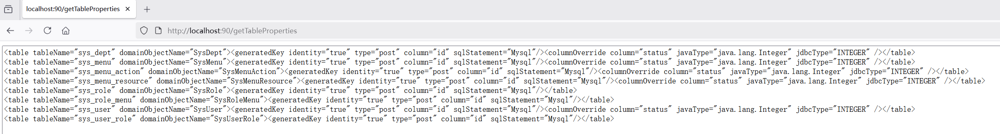

# 连接MySQL生成MBG需要的表配置信息
**运行本工程生成表配置内容，一定要连接参数`lower_case_table_names`配置为0或者2的数据库服务器**，并且是配置为0或者2之后才创建的数据表，否则，生成的表配置内容的表名，是以全部小写为基准的，并非驼峰式命名法。表配置内容生成好之后，重新生成 mapper 时连接的数据库服务器的`lower_case_table_names`配置值，对生成结果没有影响。

## 运行
两种方式
1. 本工程采用 spring boot v3.5.6 创建，可直接运行，使用 tomcat 的默认端口90，运行之后，访问：`http://localhost:90/getTableProperties`
    
1. 运行测试`WithApplicationContextTest.getTablePropertiesTest`，从控制台查看。

## 生成的表配置信息，长什么样？
象下面这样，生成好表结构之后，可根据需要修改，关于表属性配置详情，请见官方文档：https://mybatis.org/generator/running/runningFromCmdLine.html
```xml
<table tableName="sys_dept" domainObjectName="SysDept"><generatedKey identity="true" type="post" column="id" sqlStatement="Mysql"/><columnOverride column="status" javaType="java.lang.Integer" jdbcType="INTEGER" /></table>
<table tableName="sys_menu" domainObjectName="SysMenu"><generatedKey identity="true" type="post" column="id" sqlStatement="Mysql"/><columnOverride column="status" javaType="java.lang.Integer" jdbcType="INTEGER" /></table>
<table tableName="sys_menu_action" domainObjectName="SysMenuAction"><generatedKey identity="true" type="post" column="id" sqlStatement="Mysql"/><columnOverride column="status" javaType="java.lang.Integer" jdbcType="INTEGER" /></table>
<table tableName="sys_menu_resource" domainObjectName="SysMenuResource"><generatedKey identity="true" type="post" column="id" sqlStatement="Mysql"/><columnOverride column="status" javaType="java.lang.Integer" jdbcType="INTEGER" /></table>
<table tableName="sys_role" domainObjectName="SysRole"><generatedKey identity="true" type="post" column="id" sqlStatement="Mysql"/></table>
<table tableName="sys_role_menu" domainObjectName="SysRoleMenu"><generatedKey identity="true" type="post" column="id" sqlStatement="Mysql"/></table>
<table tableName="sys_user" domainObjectName="SysUser"><generatedKey identity="true" type="post" column="id" sqlStatement="Mysql"/><columnOverride column="status" javaType="java.lang.Integer" jdbcType="INTEGER" /></table>
<table tableName="sys_user_role" domainObjectName="SysUserRole"><generatedKey identity="true" type="post" column="id" sqlStatement="Mysql"/></table>
```

## 数据库版本
数据库驱动`mysql-connector-java 8.0.13`连接`MySQL 8.0.11`和`5.7.23`均测试通过。
> 目前已改为 8.0.33

## 示例数据库建表脚本
可以直接导入`resources/schema.sql`运行本示例进行测试。数据库表没有任何业务逻辑，仅作为示例。

## 数据库配置信息
数据库信息配置在`resources/application.yml`，运行前请修改成自己的数据库配置。
```
database:
  driverClassName: com.mysql.cj.jdbc.Driver
  databaseUrl: jdbc:mysql://localhost:3306/${database.schemaName}?serverTimezone=GMT&useUnicode=true&characterEncoding=utf8&allowMultiQueries=true&autoReconnect=true&failOverReadOnly=false&socketTimeout=20000
  schemaName: mbg
  username: root
  password: RoOtPaSs
  # 要保留的表名前缀
  keepPrefix: crm
  # 表名前缀长度，后面生成的配置会将前缀去掉，根据自己的业务适当修改即可。
  tableNamePrefixCount: 3
  # 需要保留表前缀的表名列表，这里仅仅是示例，并没有任何业务逻辑。
  keepPrefixTableList:
    - erp_trade
    - erp_shop_config
  # 是否使用原始字段名
  flagUseActualColumnNames: true
```

## 知识点
1. 可以通过本模块（IDEA的概念是module，Eclipse的概念是Project），学习 spring boot 2.1.1 获取 application.yml 配置信息。
1. 学习如何直接连数据库并读取数据库的所有表名，以及每张表的主键。
1. 带 spring boot 引导的单元测试，可以加载配置信息。
1. 多模块管理、将业务按功能拆分，比如业务无关的、可共用的工具类直接放到`common.lib`模块。